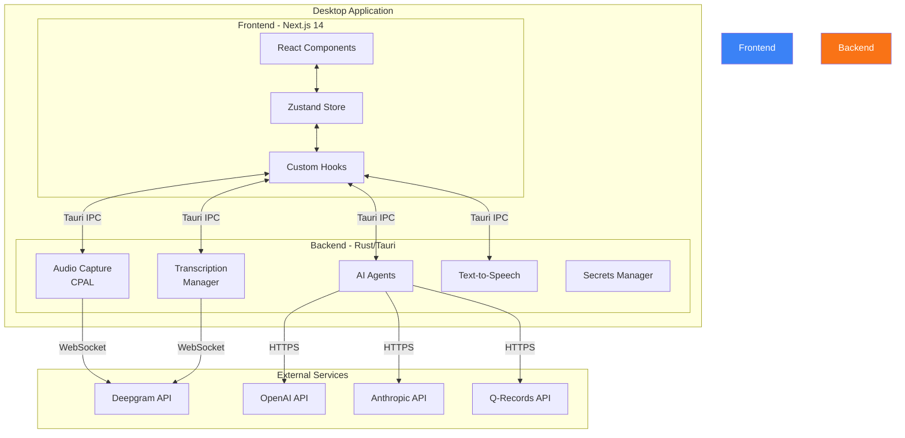
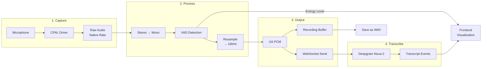
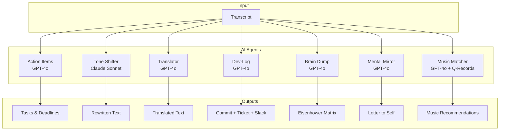
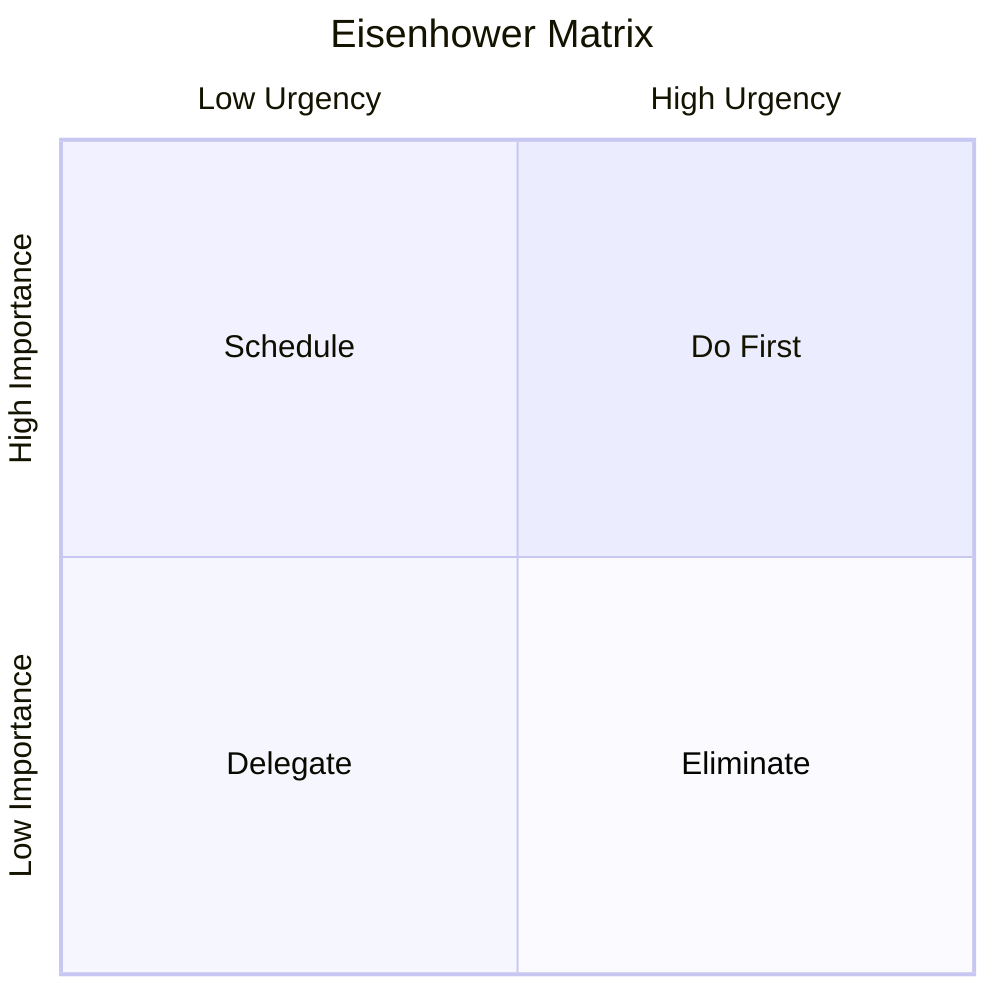
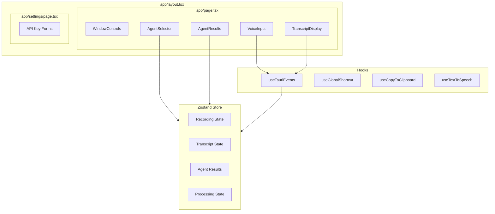
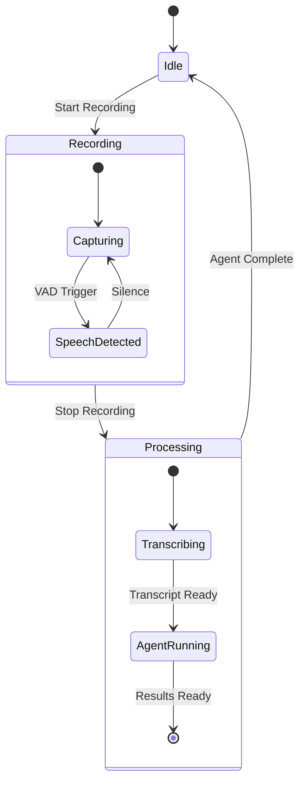
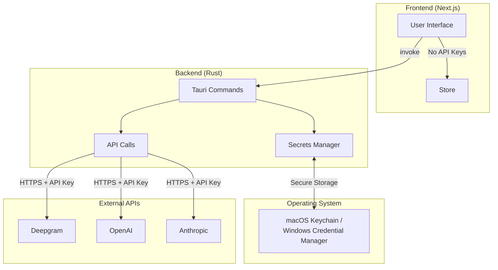

# Aurus Voice Intelligence - Architecture Documentation

> **A native desktop voice assistant built with Tauri v2 + Next.js 14**

## Table of Contents

1. [Overview](#overview)
2. [System Architecture](#system-architecture)
3. [Audio Pipeline](#audio-pipeline)
4. [AI Agents](#ai-agents)
5. [Frontend Architecture](#frontend-architecture)
6. [State Management](#state-management)
7. [API Reference](#api-reference)
8. [Security Model](#security-model)
9. [Technology Choices](#technology-choices)

---

## Overview

Aurus Voice Intelligence transforms spoken thoughts into structured, actionable outputs using a combination of real-time transcription and specialized AI agents. The application runs as a native desktop app with a Spotlight-style interface, triggered by `Cmd+Shift+V`.

### Key Capabilities

| Feature | Description |
|---------|-------------|
| **Real-time Transcription** | Live speech-to-text via Deepgram Nova-2 |
| **7 AI Agents** | Specialized processors for different use cases |
| **Native TTS** | Read results aloud using system voices |
| **Offline Support** | Local Whisper model for transcription |
| **Cross-platform** | macOS, Windows, Linux support |

---

## System Architecture



### Architecture Principles

1. **Separation of Concerns**
   - Rust handles all system-level operations (audio, network, secrets)
   - Next.js handles UI rendering and user interaction
   - No audio processing in JavaScript (avoids data corruption)

2. **Security First**
   - API keys never touch frontend code
   - Secrets stored in OS keychain (macOS Keychain / Windows Credential Manager)
   - All external API calls from Rust backend

3. **Real-time Performance**
   - Direct WebSocket from Rust to Deepgram
   - Streaming responses for all AI agents
   - 100ms audio chunks for low latency

---

## Audio Pipeline



### Audio Configuration

| Parameter | Value | Reason |
|-----------|-------|--------|
| Target Sample Rate | 16,000 Hz | Deepgram optimal rate |
| Channels | 1 (Mono) | Speech recognition standard |
| Bit Depth | 16-bit PCM | Linear16 encoding |
| Chunk Size | 100ms (~1,600 samples) | Balance latency/overhead |
| VAD Threshold | 0.02 RMS | Filters silence |

### Why Direct Rust → Deepgram?

Previous architecture sent audio through the frontend:
```
Rust → JSON Base64 → JavaScript → WebSocket
```

**Problems:**
- JSON serialization corrupted i16 samples
- Base64 encoding added 33% overhead
- JavaScript event loop introduced latency

**Current architecture:**
```
Rust → Binary WebSocket → Deepgram
```

**Benefits:**
- Zero data corruption
- Lower latency (~50ms improvement)
- Reduced CPU usage

---

## AI Agents



### Agent Details

#### 1. Action Items (GPT-4o)
Extracts actionable tasks from meeting notes or conversations.

```json
{
  "items": [
    {
      "task": "Review PR #142",
      "assignee": "John",
      "due_date": "2025-01-30",
      "priority": "high",
      "context": "Blocking release"
    }
  ],
  "summary": "3 action items identified from standup"
}
```

#### 2. Tone Shifter (Claude Sonnet 4)
Rewrites text in 8 different tones with intensity control (1-10).

**Available Tones:**
- Professional, Casual, Friendly, Formal
- Empathetic, Assertive, Diplomatic, Enthusiastic

**Why Claude for Tone?** Claude excels at nuanced writing style adaptation and maintaining context while shifting register.

#### 3. Translator (GPT-4o)
Translates to 12 languages with automatic source detection.

**Supported Languages:**
English, German, Spanish, French, Italian, Portuguese, Dutch, Russian, Japanese, Chinese, Korean, Arabic

#### 4. Dev-Log (GPT-4o)
Transforms developer rambling into structured documentation.

**Outputs:**
- Conventional Commit message
- Jira/Linear ticket with acceptance criteria
- Slack team update

#### 5. Brain Dump (GPT-4o)
Categorizes unstructured thoughts into the Eisenhower Matrix.



#### 6. Mental Mirror (GPT-4o)
Transforms daily reflections into compassionate self-letters.

**Sections:**
1. **Reflection** - What happened and how you felt
2. **Mental Check-in** - Psychological state assessment
3. **The Release** - Cognitive reframing of worries
4. **Message to Tomorrow** - Encouragement for future self

#### 7. Music Matcher (GPT-4o + Q-Records)
Analyzes mood from transcript and finds matching music.

**Flow:**
1. GPT-4o extracts mood keywords
2. Q-Records API returns matching tracks
3. Results include mood tags, energy level, genre

---

## Frontend Architecture



### Component Responsibilities

| Component | Purpose | Key Props/State |
|-----------|---------|-----------------|
| `VoiceInput` | Record button, waveform visualization | `recordingState`, `audioEnergy` |
| `TranscriptDisplay` | Live + final transcript | `transcript`, `interimTranscript` |
| `AgentSelector` | Agent buttons grid | `activeAgent`, `isProcessing` |
| `AgentResults` | Dynamic results per agent type | All agent result states |
| `ToneSelector` | Tone/intensity controls | `selectedTone`, `toneIntensity` |
| `WindowControls` | Frameless window chrome | Tauri window API |

---

## State Management



### Zustand Store Structure

```typescript
interface VoiceState {
  // Recording
  recordingState: 'idle' | 'recording' | 'processing';
  hasRecording: boolean;
  recordingDuration: number;

  // Transcript
  transcript: string;
  interimTranscript: string;

  // VAD
  isSpeechDetected: boolean;
  audioEnergy: number;

  // Agent Selection
  activeAgent: AgentType | null;

  // Agent Results (per agent)
  actionItems: ActionItem[];
  toneShiftResult: ToneShiftResult | null;
  translationResult: TranslationResult | null;
  devLogResult: DevLogResult | null;
  brainDumpResult: BrainDumpResult | null;
  mentalMirrorResult: MentalMirrorResult | null;

  // Streaming buffers
  toneShiftStreaming: string;
  translationStreaming: string;
  devLogStreaming: string;
  brainDumpStreaming: string;
  mentalMirrorStreaming: string;

  // Processing
  isProcessing: boolean;
  processingMessage: string;
  error: string | null;
}
```

---

## API Reference

### Tauri Commands

#### Audio
```typescript
invoke('start_recording')
invoke('stop_recording')
invoke('is_recording') → boolean
invoke('save_recording', { filepath: string })
invoke('get_recording_duration') → number
```

#### Transcription
```typescript
invoke('start_deepgram_stream', { apiKey: string })
invoke('stop_deepgram_stream')
invoke('is_deepgram_streaming') → boolean
```

#### Agents
```typescript
invoke('extract_action_items', { apiKey, transcript })
invoke('shift_tone_streaming', { apiKey, text, targetTone, intensity })
invoke('translate_text_streaming', { apiKey, text, sourceLanguage, targetLanguage })
invoke('generate_dev_log_streaming', { apiKey, transcript })
invoke('process_brain_dump_streaming', { apiKey, transcript })
invoke('generate_mental_mirror_streaming', { apiKey, transcript })
```

### Tauri Events

```typescript
// Audio
listen('vad-event', (e) => { is_speech, energy })
listen('audio-chunk', (e) => { samples: number[] })

// Transcription
listen('transcript', (e) => { text, is_final, confidence })

// Agent streaming
listen('tone-shift-chunk', (e) => { text, is_complete })
listen('translation-chunk', (e) => { text, is_complete })
listen('dev-log-chunk', (e) => { text, is_complete })
listen('brain-dump-chunk', (e) => { text, is_complete })
listen('mental-mirror-chunk', (e) => { text, is_complete })

// Agent complete
listen('action-items-extracted', (e) => ActionItemsResult)
listen('tone-shift-complete', (e) => ToneShiftResult)
listen('translation-complete', (e) => TranslationResult)
```

---

## Security Model



### Security Principles

1. **API Keys in Keychain** - Never stored in files or environment variables
2. **No Frontend Secrets** - All API calls originate from Rust
3. **HTTPS Only** - All external communication encrypted
4. **Local Processing Option** - Whisper model runs entirely offline

---

## Technology Choices

### Why Tauri + Next.js?

| Alternative | Why Not |
|-------------|---------|
| Electron | 100MB+ bundle, high memory usage |
| Pure Web | No microphone access, no native TTS |
| Flutter | Less mature desktop support |
| Qt/GTK | Slower UI development |

**Tauri Benefits:**
- 5-10MB binary size
- Native OS integration (keychain, TTS)
- Rust performance for audio processing
- Web technologies for rapid UI development

### Why Rust for Audio?

| Language | Audio Latency | Memory Safety | Async Support |
|----------|---------------|---------------|---------------|
| Rust | Excellent | Guaranteed | Native |
| C++ | Excellent | Manual | Complex |
| Node.js | Poor | N/A | Good |
| Python | Poor | N/A | Good |

### Why Zustand over Redux?

- Simpler API, less boilerplate
- No action creators or reducers
- TypeScript-first design
- Smaller bundle size

### Why Deepgram Nova-2?

| Service | Latency | Accuracy | Streaming | Price |
|---------|---------|----------|-----------|-------|
| Deepgram Nova-2 | ~300ms | 95%+ | Yes | $0.0043/min |
| Google STT | ~500ms | 93% | Yes | $0.006/min |
| AWS Transcribe | ~1s | 92% | Yes | $0.024/min |
| OpenAI Whisper | Batch only | 97% | No | $0.006/min |

---

## File Structure

```
ai-voiceagent/
├── app/                          # Next.js frontend
│   ├── components/               # React components
│   │   ├── AgentResults.tsx      # Dynamic agent output display
│   │   ├── AgentSelector.tsx     # Agent button grid
│   │   ├── TranscriptDisplay.tsx # Live transcript view
│   │   ├── VoiceInput.tsx        # Record button + waveform
│   │   └── WindowControls.tsx    # Frameless window chrome
│   ├── hooks/                    # Custom React hooks
│   │   ├── useTauriEvents.ts     # Tauri event listeners
│   │   └── useGlobalShortcut.ts  # Keyboard shortcuts
│   ├── store/
│   │   └── voiceStore.ts         # Zustand state management
│   ├── settings/
│   │   └── page.tsx              # API key configuration
│   ├── layout.tsx                # Root layout
│   └── page.tsx                  # Main application page
├── src-tauri/                    # Rust backend
│   ├── src/
│   │   ├── lib.rs                # Tauri setup + command registration
│   │   ├── audio.rs              # CPAL audio capture + VAD
│   │   ├── transcription.rs      # Deepgram/AssemblyAI/Whisper
│   │   ├── secrets.rs            # API key management
│   │   ├── tts.rs                # Native text-to-speech
│   │   └── agents/               # AI agent implementations
│   │       ├── action_items.rs
│   │       ├── tone_shifter.rs
│   │       ├── translator.rs
│   │       ├── dev_log.rs
│   │       ├── brain_dump.rs
│   │       ├── mental_mirror.rs
│   │       └── music_matcher.rs
│   ├── Cargo.toml                # Rust dependencies
│   └── tauri.conf.json           # Tauri configuration
├── docs/                         # Documentation
│   ├── ARCHITECTURE.md           # This file
│   ├── IDEAS.md                  # Future enhancements
│   └── TODO.md                   # Pending tasks
└── .memory/                      # Session checkpoints
```

---

## Performance Metrics

| Metric | Target | Actual |
|--------|--------|--------|
| App Launch | < 2s | ~1.5s |
| Recording Start | < 100ms | ~50ms |
| Transcript Latency | < 500ms | ~300ms |
| Agent Response (streaming start) | < 1s | ~800ms |
| Memory Usage (idle) | < 100MB | ~80MB |
| Binary Size | < 20MB | ~15MB |

---

*Documentation generated for Aurus Voice Intelligence v0.2.1*
