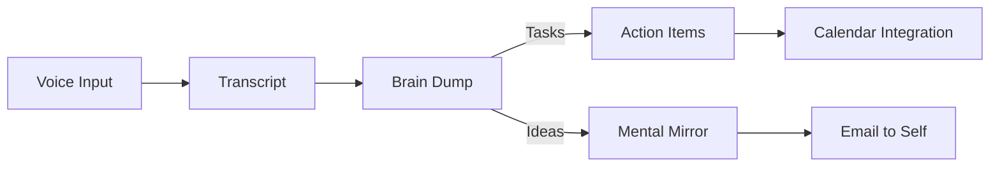
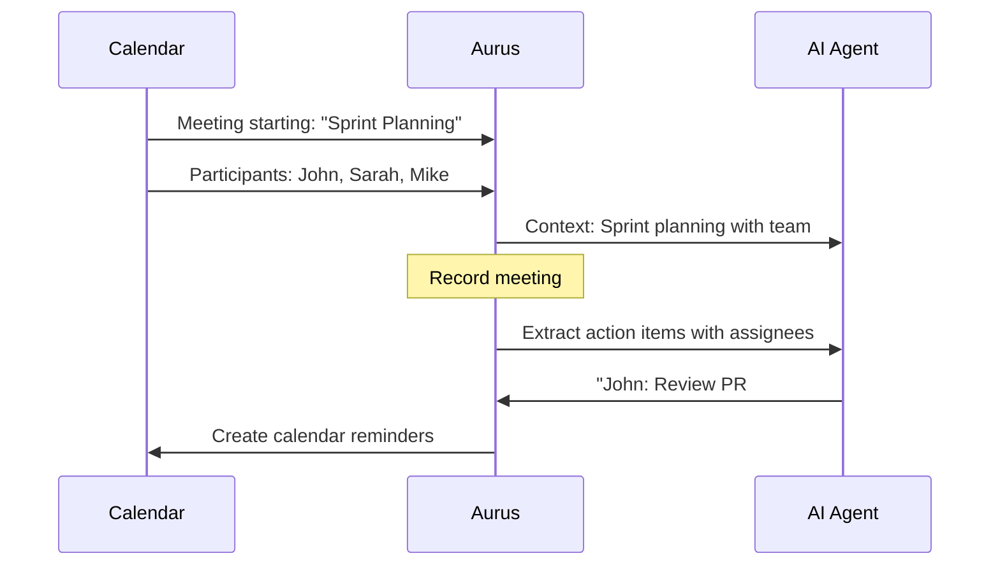
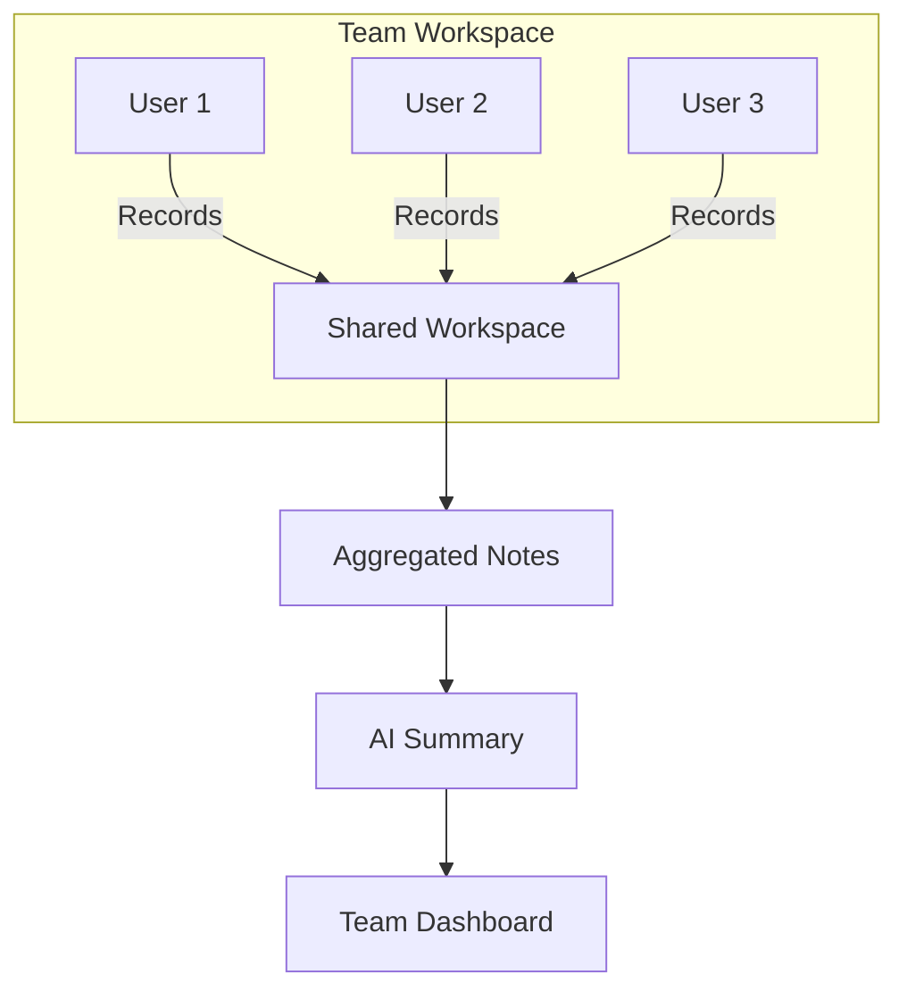
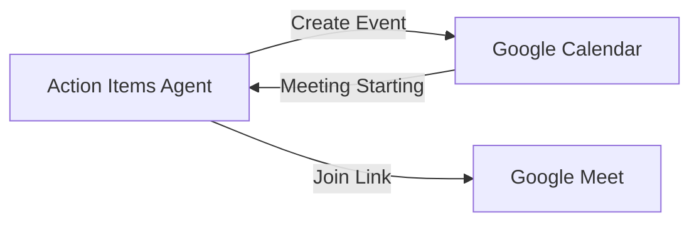
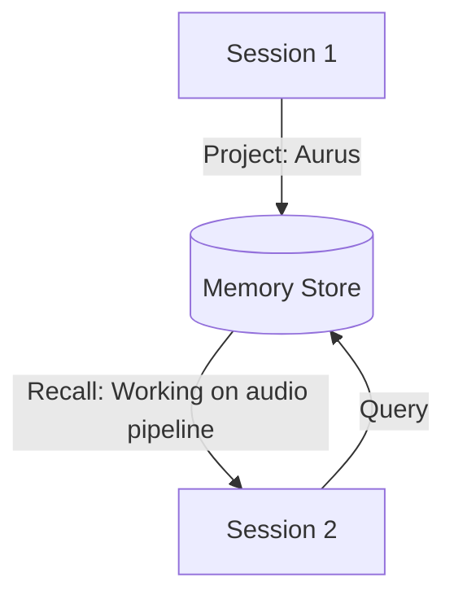
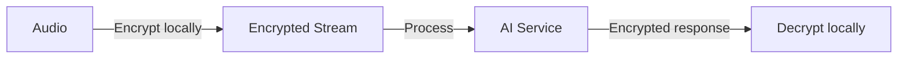
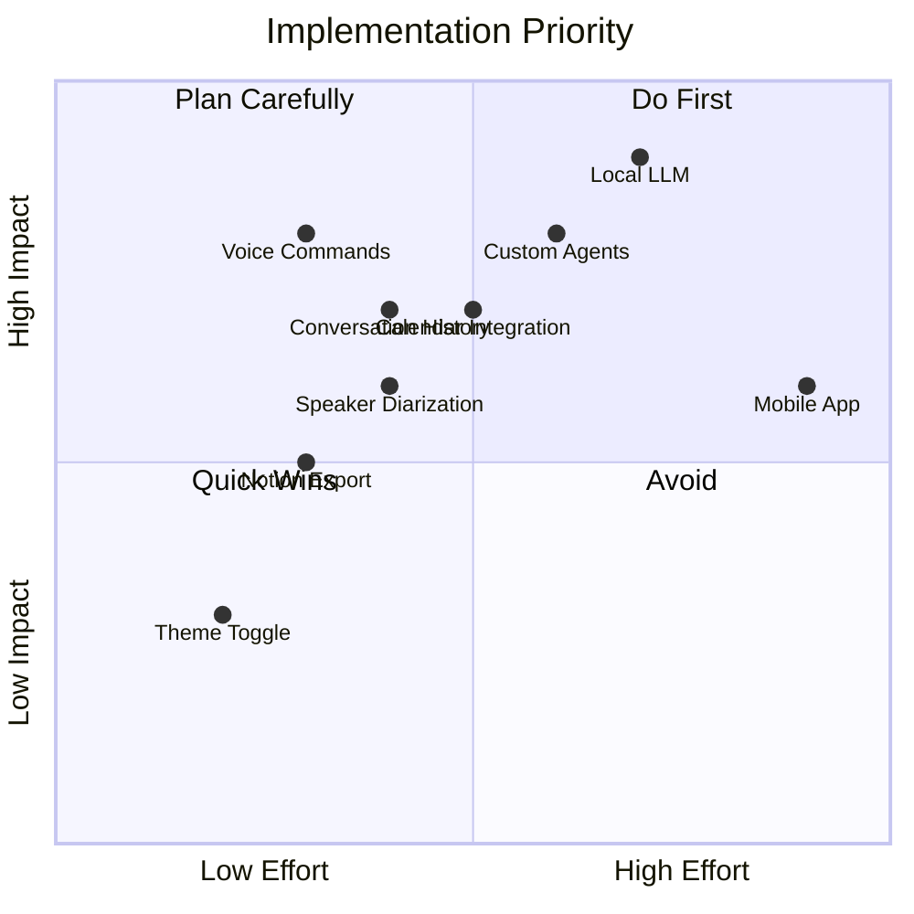

# Ideas & Future Enhancements

> **Vision:** Transform Aurus into the ultimate voice-first productivity companion

---

## 🚀 High Priority Ideas

### 1. Multi-Modal Agent Pipeline
**Chain agents together for complex workflows**



**Use Case:** Record a brain dump, automatically extract tasks to calendar, send reflections as email.

---

### 2. Voice Commands & Hotwords
**Hands-free agent activation**

```
"Hey Aurus, shift this to professional"
"Aurus, translate to German"
"Create action items"
```

**Implementation:**
- Local hotword detection (Porcupine/Snowboy)
- Command parsing with lightweight NLU
- No cloud dependency for activation

---

### 3. Context-Aware Meeting Assistant
**Integrate with calendar and participants**



**Features:**
- Auto-detect meeting context from calendar
- Pre-populate participant names for assignment
- Post-meeting summary email to attendees

---

### 4. Local LLM Support
**Privacy-first AI processing**

| Model | Use Case | Size | Speed |
|-------|----------|------|-------|
| Llama 3.2 3B | Action Items | 2GB | Fast |
| Mistral 7B | Tone Shifting | 4GB | Medium |
| Phi-3 Mini | Quick Tasks | 1.5GB | Fastest |

**Benefits:**
- Zero cloud dependency
- HIPAA/GDPR compliance
- Works offline
- No API costs

**Implementation:** Integrate `llama.cpp` or `candle` for Rust-native inference.

---

### 5. Collaborative Workspaces
**Team features for shared voice notes**



**Features:**
- Shared transcript library
- Team action item tracking
- Meeting insights across sessions
- Role-based access control

---

## 🎨 UI/UX Improvements

### 6. Conversation History
**Persistent transcript library with search**

```
┌─────────────────────────────────────────┐
│ 🔍 Search transcripts...                │
├─────────────────────────────────────────┤
│ Today                                   │
│ ├─ Sprint Planning (45 min) 🎯 5 tasks  │
│ ├─ 1:1 with Sarah (30 min) 💭 2 ideas   │
│ └─ Quick note (2 min)                   │
│                                         │
│ Yesterday                               │
│ ├─ Client call (1 hr) 📋 8 tasks        │
│ └─ Brain dump (15 min) 🧠 categorized   │
└─────────────────────────────────────────┘
```

**Features:**
- SQLite local database
- Full-text search
- Filter by agent type, date, duration
- Export to Markdown/JSON

---

### 7. Customizable Agent Cards
**Drag-and-drop agent arrangement**

```
┌──────────┬──────────┬──────────┐
│ Action   │ Tone     │ Dev-Log  │
│ Items    │ Shifter  │          │
├──────────┼──────────┼──────────┤
│ Brain    │ Mental   │ Custom   │
│ Dump     │ Mirror   │ Agent    │
└──────────┴──────────┴──────────┘
     ↑ Drag to reorder ↑
```

**Features:**
- Pin favorite agents
- Hide unused agents
- Custom agent shortcuts
- Theming per agent

---

### 8. Dark/Light Theme Toggle
**System-aware theming**

```css
/* Current: Dark only */
/* Planned: Auto-detect + manual toggle */

:root[data-theme="light"] {
  --voice-background: #ffffff;
  --voice-surface: #f5f5f5;
  --voice-primary: #6366f1;
}
```

---

### 9. Waveform Visualization Upgrade
**Real-time spectrogram display**

```
Current:  ▁▂▃▅▇▅▃▂▁ (amplitude bars)

Proposed: ████████████ 8kHz
          ██████████░░ 4kHz
          ████████░░░░ 2kHz
          ██████░░░░░░ 1kHz
          ████░░░░░░░░ 500Hz
```

**Benefits:**
- Frequency visualization helps identify speaker
- Visual feedback for audio quality
- Detect background noise issues

---

## 🔌 Integrations

### 10. Calendar Integration
**Bi-directional sync with Google/Outlook**



**Features:**
- Create tasks as calendar events
- Auto-record scheduled meetings
- Deadline reminders from extracted dates

---

### 11. Notion/Obsidian Export
**Direct sync to knowledge bases**

```
Aurus → Notion
├─ Action Items → Notion Tasks Database
├─ Brain Dump → Notion Page (Eisenhower embed)
├─ Dev-Log → Notion Changelog
└─ Mental Mirror → Notion Journal
```

**Obsidian:**
- Export as Markdown with YAML frontmatter
- Auto-link related notes
- Tag extraction from content

---

### 12. Slack/Teams Bot
**Share results directly to channels**

```
/aurus summary → Posts meeting summary
/aurus tasks → Posts action items
/aurus standup → Generates standup update from yesterday's notes
```

---

### 13. Zapier/Make Webhooks
**Connect to 5000+ apps**

```json
{
  "event": "action_items_extracted",
  "payload": {
    "items": [...],
    "transcript_id": "abc123"
  }
}
```

**Triggers:**
- New transcript created
- Action items extracted
- Brain dump categorized
- Mental mirror generated

---

## 🧠 AI Enhancements

### 14. Custom Agent Builder
**No-code agent creation**

```yaml
# custom_agent.yaml
name: "PR Reviewer"
model: gpt-4o
system_prompt: |
  You are a code review assistant.
  Extract: bugs, improvements, questions
output_schema:
  bugs: array
  improvements: array
  questions: array
```

**UI:**
- Visual prompt builder
- Test with sample transcripts
- Share agents with community

---

### 15. Agent Memory
**Cross-session context retention**



**Features:**
- Vector embedding of past sessions
- Semantic search for context
- "Continue where we left off" capability

---

### 16. Multi-Language Transcription
**Real-time language detection**

```
Current: German only (language=de)

Proposed: Auto-detect + specify
├─ "Detected: German (93% confidence)"
├─ "Switching to English..."
└─ "Mixed language: DE/EN code-switching"
```

---

### 17. Speaker Diarization
**Who said what?**

```
[Speaker 1 - John]: Let's discuss the roadmap
[Speaker 2 - Sarah]: I think we should prioritize mobile
[Speaker 1 - John]: Agreed, let's add that to the backlog
```

**Implementation:**
- Deepgram diarization feature
- Speaker identification training
- Per-speaker action item assignment

---

## 🔒 Privacy & Security

### 18. End-to-End Encryption
**Zero-knowledge architecture**



**Features:**
- Client-side encryption keys
- Encrypted local storage
- No plaintext on servers

---

### 19. Self-Hosted Option
**Docker deployment for enterprises**

```yaml
# docker-compose.yml
services:
  aurus-api:
    image: aurus/voice-api:latest
    environment:
      - WHISPER_MODEL=large-v3
      - LLM_ENDPOINT=http://ollama:11434

  ollama:
    image: ollama/ollama:latest
    volumes:
      - ./models:/root/.ollama
```

---

### 20. Audit Logging
**Compliance-ready tracking**

```json
{
  "timestamp": "2025-01-29T10:00:00Z",
  "action": "transcript_created",
  "user": "user@company.com",
  "data_classification": "confidential",
  "retention_days": 90
}
```

---

## 📱 Platform Expansion

### 21. Mobile Companion App
**iOS/Android for on-the-go capture**

```
┌─────────────────────┐
│     📱 Aurus        │
├─────────────────────┤
│                     │
│    🎙️ Recording...  │
│    ━━━━━━━━━━━━━    │
│    02:34            │
│                     │
│  [Stop & Process]   │
│                     │
│  Syncs to desktop   │
└─────────────────────┘
```

**Features:**
- Record on phone, process on desktop
- Push notifications for action items
- Widget for quick capture

---

### 22. Browser Extension
**Capture from any web page**

```
Right-click → "Send to Aurus"
├─ Selected text → Tone Shifter
├─ Meeting transcript → Action Items
└─ Article → Brain Dump summary
```

---

### 23. CLI Tool
**Terminal-first interface**

```bash
$ aurus record --duration 5m
Recording... (Ctrl+C to stop)

$ aurus process --agent action-items
Found 3 action items:
  1. [HIGH] Review PR #142 - @john - Due: Jan 30
  2. [MED] Update documentation - @sarah
  3. [LOW] Research caching options

$ aurus export --format markdown > notes.md
```

---

## 💡 Experimental Ideas

### 24. Voice Cloning for TTS
**Read results in your own voice**

- Train personal voice model (5 min sample)
- Natural-sounding playback
- Emotional tone matching

### 25. Real-Time Translation
**Live interpretation during calls**

```
You (English) → Aurus → Translated audio → Them (German)
Them (German) → Aurus → Translated audio → You (English)
```

### 26. Sentiment Timeline
**Emotional journey visualization**

```
😊 ────────────────────────────────────────
😐 ──────╲──────────────────────╱──────────
😔 ───────╲────────────────────╱───────────
    0:00   1:00   2:00   3:00   4:00   5:00
           ↑ Discussed challenges  ↑ Found solution
```

### 27. Voice Journaling with Prompts
**Guided reflection sessions**

```
Aurus: "What was the highlight of your day?"
You: [Record response]
Aurus: "What challenged you?"
You: [Record response]
Aurus: "What are you grateful for?"
You: [Record response]
→ Generates comprehensive journal entry
```

---

## Priority Matrix



---

*Ideas document for Aurus Voice Intelligence - Updated January 2025*
